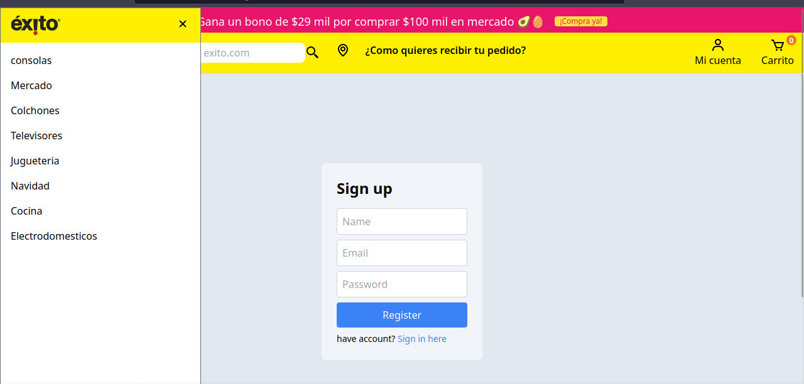

# CLON ÉXITO

https://65e29c84f6822d60dc3fb45d--lucky-pixie-af7ff2.netlify.app/

Desarrollé un clon de la aplicación web Éxito, que permitirá a los usuarios realizar compras. Implementé funcionalidades como inicio de sesión, navegación por categorías de productos y gestión del carrito de compras. El proyecto demostró mi capacidad para crear experiencias de usuario completas y funcionales en entornos web.





## Instalación y Ejecución del Proyecto

Sigue estos pasos para ejecutar el proyecto en tu máquina local:

```bash
# 1. Clonar el repositorio
git clone https://github.com/Deiiivy/Exito-CLON.git
cd tu_repositorio


# 2. Ejecutar el Servidor
cd server
npm install
npm start

# 3. Ejecutar el Cliente
cd ../client
npm install
npm start


